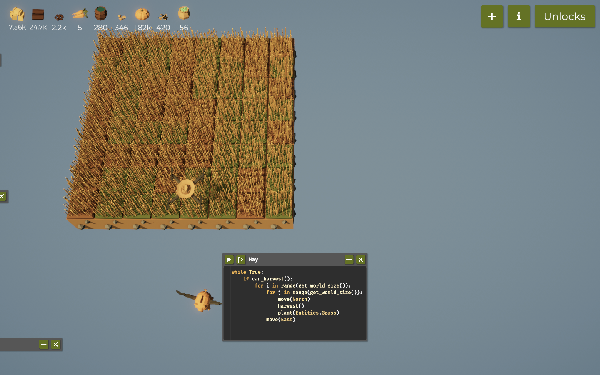
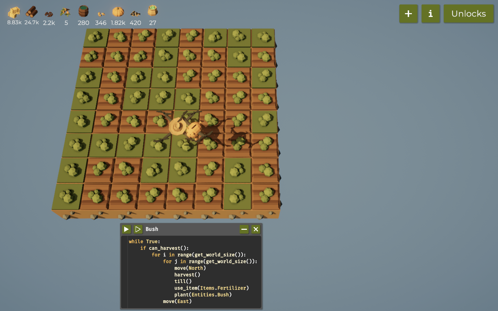
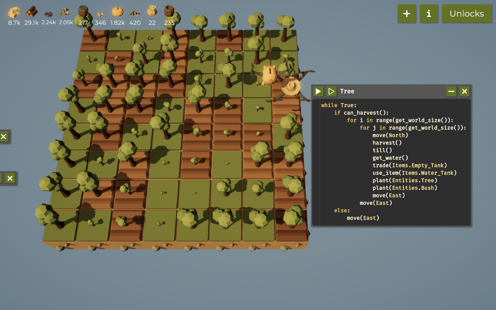
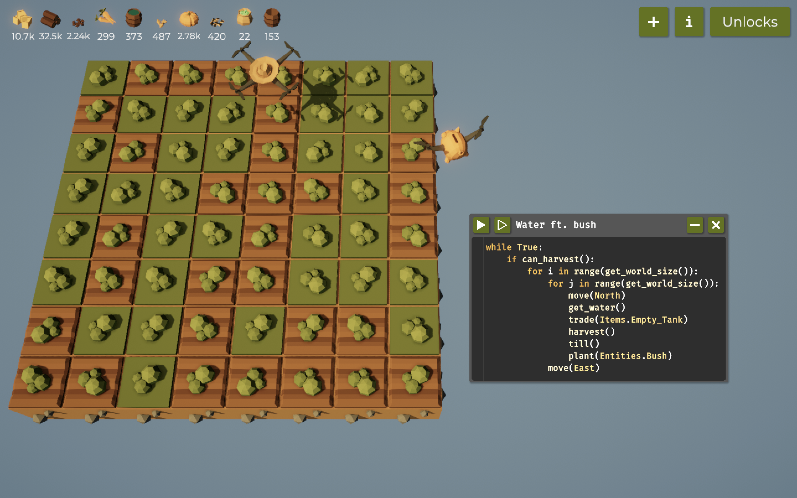
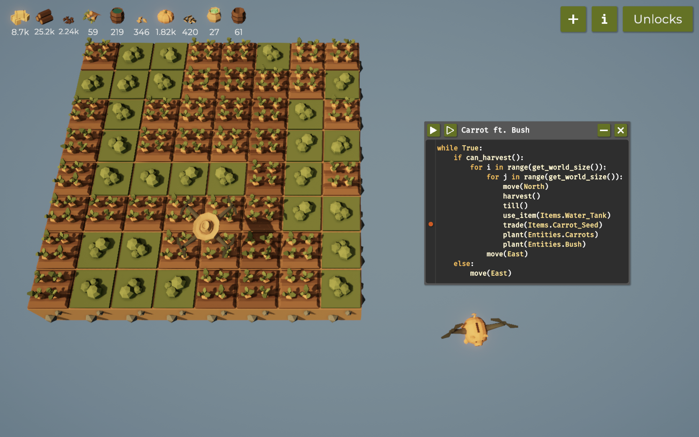
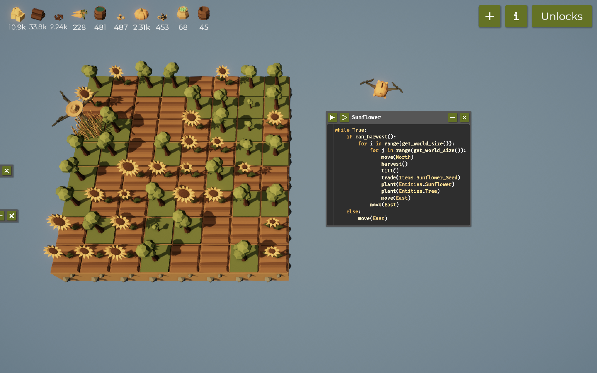
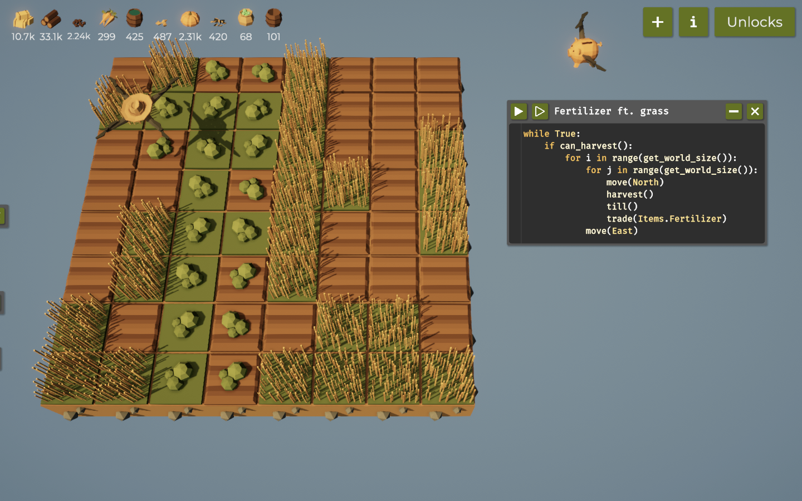

# Programming the Farming Drone (Report)

## Introduction
The game is based on coding and through coding we should farm the required number of plants to unlock and proceed into another level.

# Table of Contents
- [Code Snippets and Explanation](#code-snippets-and-explanation)
- [Challenges and Learnings](#challenges-and-learnings)
- [References](#references)

# Code-Snippets-and-Explanation
Write and explain your code along with recordings.

## Step 1: Farming on 1 tile
**Code:**
```python
while True:
    if can_harvest():
        harvest()
```

**Explanation:**
The code runs an infinite number of times and harvest the grass with the if condition.

**Demo:**
Image Demo:


## Step 2: Farming on 8x8 tile
**Code:**
```python
# Code to go around and farm grass
while True:
    if can_harvest():
        for i in range(get_world_size()):
            for j in range(get_world_size()):
                harvest()
                move(North)
            move(East)
```

**Explanation:**
The code makes the drone go one square at a time harvests the grass with the if condition.

**Demo:**
Image Demo:


## Step 3: Farming Bush on 8x8 tile
**Code:**
```python
# Code to go around and farm bush
while True:
    if can_harvest():
        for i in range(get_world_size()):
            for j in range(get_world_size()):
                harvest()
                till()
                move(North)
                plant(Entities.Bush)
            move(East)
```

**Explanation:**
The code makes the drone go north at the max and then to the east at a time harvests the bush with the if condition.

**Demo:**
Image Demo:


## Step 4: Farming tree on 8x8 tile
**Code:**
```python
while True:
    if can_harvest():
        for i in range(get_world_size()):
            for j in range(get_world_size()):
                move(North)
                harvest()
                till()
                plant(Entities.Tree)
            move(East)
```

**Explanation:**
The code makes the drone go north at the max and then to the east at a time harvests the tree with the if condition.

**Demo:**
Image Demo:


## Step 5: Farming Bush with water on 8x8 tile
**Code:**
```python
while True:
    if can_harvest():
        for i in range(get_world_size()):
            for j in range(get_world_size()):
                move(North)
                harvest()
                till()
                plant(Entities.Bush)
            move(East)
```


**Explanation:**
The code makes the drone go north at the max and then to the east at a time harvests the Bush using water, with the if condition.

**Demo:**
Image Demo:


## Step 6: Farming Carrot on 8x8 tile
**Code:**
```python
while True:
    if can_harvest():
        for i in range(get_world_size()):
            for j in range(get_world_size()):
                move(North)
                harvest()
                till()
                trade(Item.Carrot_Seed)
                plant(Entities.Carrot)
            move(East)
```

**Explanation:**
The code makes the drone go north at the max and then to the east at a time harvests the carrot and bush alternatively with the if condition.

**Demo:**
Image Demo:


## Step 7: Farming Pumpkin on 8x8 tile
**Code:**
```python
while True:
    if can_harvest():
        for i in range(get_world_size()):
            for j in range(get_world_size()):
                harvest()
                till()
                move(North)
                plant(Entities.Bush)
            move(East)

    else:
        move(East)
```

**Explanation:**
The code makes the drone go north at the max and then to the east at a time harvests the pumpkin with the if condition.

**Demo:**
Image Demo:


## Step 8: Farming Sunflower on 8x8 tile
**Code:**
```python
while True:
    if can_harvest():
        for i in range(get_world_size()):
            for j in range(get_world_size()):
                move(North)
                harvest()
                till()
                trade(Items.Sunflower_Seed)
                plant(Entities.Sunflower)
            move(East)
```

**Explanation:**
The code makes the drone go north at the max and then to the east at a time harvests the sunflower with the if condition.

**Demo:**
Image Demo:


## Step 9: Extracting Fertilizer on 8x8 tile
**Code:**
```python
while True:
    if can_harvest():
        for i in range(get_world_size()):
            for j in range(get_world_size()):
                harvest()
                till()
                move(North)
                trade(Items.Fertilizer)
            move(East)
```

**Explanation:**
The code makes the drone go north at the max and then to the east at a time extraxts the fertilizer with the if condition.

**Demo:**
Image Demo:



**Notes**
- Using the code above, I was able to gather sufficient hay, pumpkins, and entities to unlock tiles and upgrade speed and yield.
- Additionally, I unlocked key features like variables and functions.
- With enough entities, I could further unlock functions, variables, and operators, simplifying and optimizing my code.
- After extensive coding, I also unlocked fertilizer and water, which significantly boosted the growth rate of my plants.

# Challenges and Learnings
## Challenges
Multi-trade was tough for me as i wanted trade pumpkin seed and carrot seed together but it was not possible.
It was tough creating maze for treasure, the youtube videos and guides were also useless for me.
I upgraded the speed in my unlocks using hays, pumpkins and carrots, according to required amount.

## Learnings
In this project, I learned to use algorithms like Breadth-First Search (BFS) and Depth-First Search (DFS) to optimize the drone’s tile coverage, with greedy algorithms prioritizing high-value tiles. Dynamic programming reduced repetitive calculations, and recursive backtracking ensured complete tile coverage. Collision detection and boundary checks kept the drone safe and within grid limits, enhancing overall efficiency.

## References
List any resources, articles, or libraries you used or referenced while working on this project.
1. [Treasure in the farmer was replaced](https://www.youtube.com/watch?v=v3M8rqMS0_M)